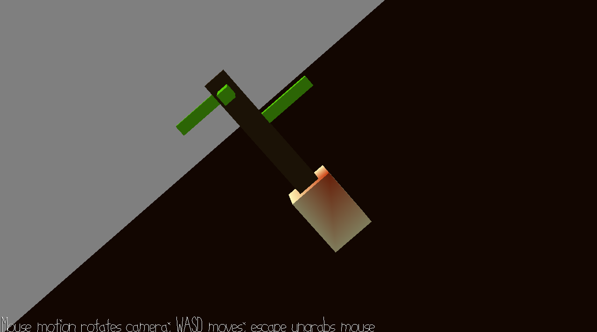

# Plant-Based Flying Simulator

Author: Vishant Raajkumar

Design: Fun game where you can fly around and look at a cool plant. Basically the next evolution of Microsoft Flight Simulator.

Screen Shot:

How To Play:

Use the mouse to rotate the camera and WASD to move.

This game was built with [NEST](NEST.md).
